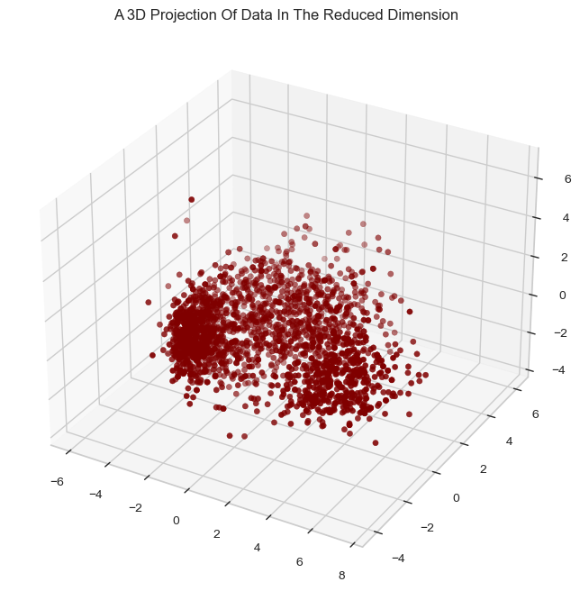
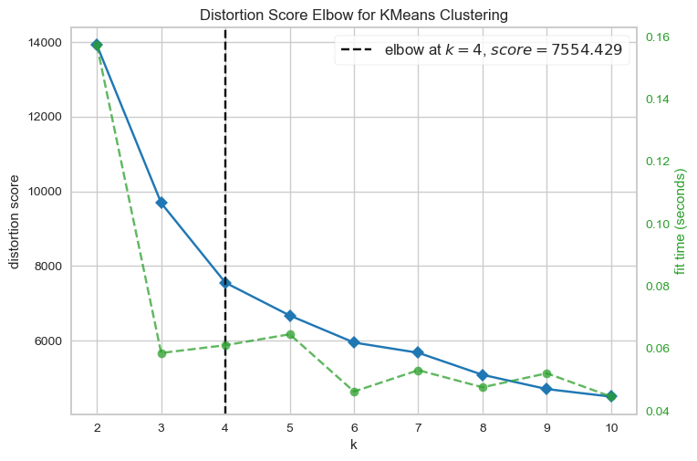
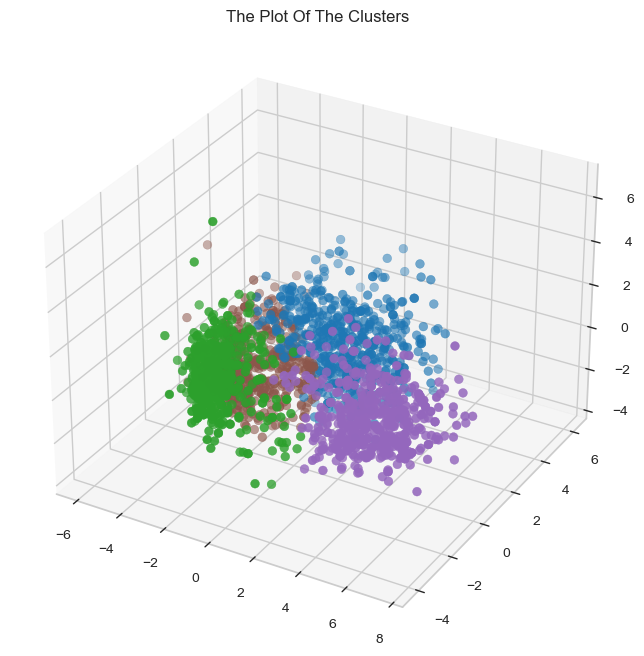
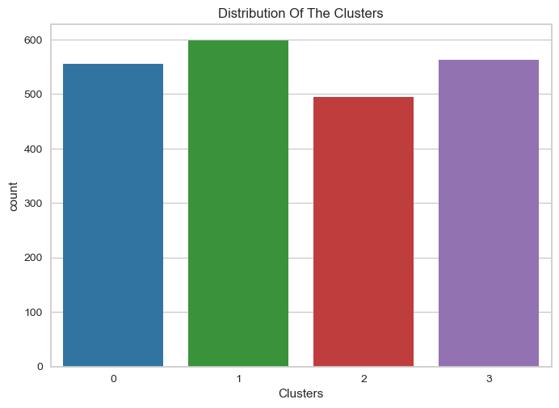
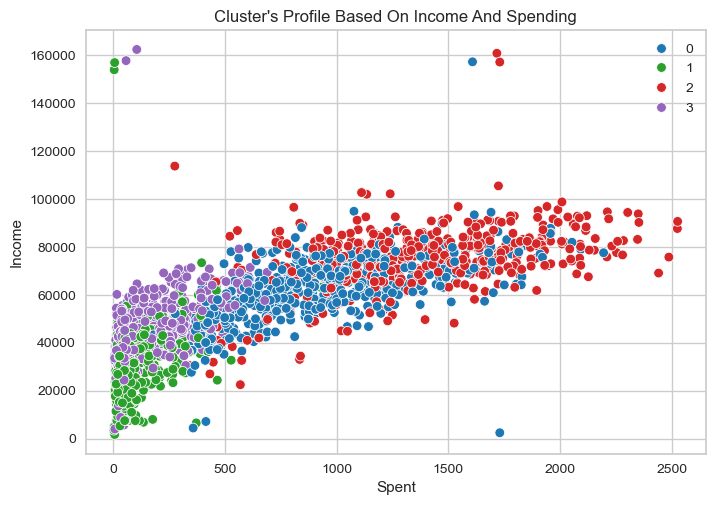

# Customer Segmentation Using Clustering

## Project Overview

The goal of this project is to segment customers based on their demographic and behavioral characteristics using unsupervised learning algorithms. Customer segmentation is crucial for businesses to target specific groups of customers with personalized marketing strategies, improving customer satisfaction and optimizing marketing efforts. The dataset used contains 2240 customers and 29 features, including demographic information, purchasing behavior, and responses to various marketing campaigns.

### Dataset Description

The dataset contains 29 features, some of which are:

**Demographic Information:** Year_Birth, Education, Marital_Status, Income.

**Behavioral Information:** Features like Kidhome, Teenhome, and customer interactions with marketing campaigns (e.g., AcceptedCmp1, AcceptedCmp2, etc.).

**Customer Registration Date:** Dt_Customer, which captures when the customer joined the company.
This dataset provides a rich set of features to analyze customer behaviors and group them into meaningful clusters.

### Data Preprocessing

The first step in the project involved cleaning the dataset to prepare it for analysis:

**Handling Missing Data:** Any missing values in the dataset were imputed or removed to ensure the integrity of the analysis.

**Encoding Categorical Variables:** Features like Education, Marital_Status, and other categorical variables were converted to numerical values using Label Encoding to allow them to be used in clustering algorithms.

**Feature Scaling:** Numerical features like Income, Age, and others were scaled using StandardScaler to ensure that all features contributed equally to the clustering process. This scaling was necessary because clustering algorithms like KMeans are sensitive to differences in feature magnitudes.

**Feature Engineering:** New features such as Age (calculated from Year_Birth) and Income per person (calculated from Income / (Kidhome + Teenhome)) were derived to provide more meaningful insights.

### Dimensionality Reduction

Before applying clustering algorithms, Principal Component Analysis (PCA) was used to reduce the dimensionality of the dataset. PCA helps in transforming high-dimensional data into a smaller number of components, while retaining as much of the data's variance as possible.

**Why PCA?**

High-dimensional data can be difficult to visualize and may suffer from the curse of dimensionality, which can negatively impact the performance of clustering algorithms. By using PCA, the dataset was reduced to a manageable number of principal components, enabling us to:

Visualize the data in 2D or 3D space.
Improve clustering performance by removing noise and redundant features.
Quantification and Process
PCA was applied to the data, and the first two principal components were selected for visualization. The explained variance ratio for the first few components was assessed to ensure that the dimensionality reduction process retained a sufficient amount of the original variance.

For example:

The first principal component (PC1) explained 45% of the variance.
The second principal component (PC2) explained 30% of the variance.
Together, the first two components explained 75% of the total variance in the data.
This reduction allowed us to visualize customer segments in a 2D space, making it easier to interpret and analyze the clustering results.

### Clustering

Once the dimensionality of the data was reduced, we applied clustering algorithms to group customers into distinct segments.

**KMeans Clustering**

KMeans was the first clustering algorithm used. KMeans works by partitioning the data into k clusters based on feature similarity. It minimizes the sum of squared distances between data points and their cluster centroids. The process for applying KMeans involved:

Selecting the optimal number of clusters (k): The Elbow Method was used to find the ideal k. By plotting the explained variance against different values of k, the point where the variance starts to level off (the "elbow") indicated the best choice for k.

The optimal number of clusters was determined to be 4 based on the Elbow Method.

Clustering: After determining k = 4, KMeans was applied, and the customers were divided into four clusters based on their features.

Quantification of Clustering Performance
To evaluate the effectiveness of the clustering algorithms, Silhouette Scores were computed. The Silhouette Score measures how well-separated the clusters are. A score closer to +1 indicates that the clusters are well-separated, while a score closer to -1 suggests that the points are poorly clustered.

KMeans: The Silhouette Score for KMeans clustering was 0.67, indicating a good clustering performance.

Agglomerative Clustering: The Silhouette Score for Agglomerative Clustering was 0.62, which is slightly lower than KMeans but still indicates reasonable cluster separation.

Results and Insights
The customer segmentation resulted in four distinct clusters, each representing a unique group of customers based on their characteristics:

**Cluster 1:** High-income customers, typically older, and more likely to engage in marketing campaigns.

**Cluster 2:** Younger customers with moderate income, showing low engagement with marketing campaigns.

**Cluster 3:** Low-income customers, less likely to respond to marketing campaigns.

**Cluster 4:** Middle-aged customers with varying income levels but generally low engagement.

These clusters offer valuable insights into customer behavior, which can be used to develop personalized marketing strategies.

### Future Improvements
While this project provides valuable insights, there are several improvements that could be made:

Experiment with Other Clustering Algorithms: Algorithms such as DBSCAN and Gaussian Mixture Models (GMM) could be explored to potentially improve the clustering results, especially if the dataset contains noise or non-spherical clusters.

Hyperparameter Tuning: Further fine-tuning of clustering algorithms, especially KMeans (e.g., adjusting initialization methods or the number of iterations), could yield even better segmentation.

Additional Feature Engineering: More advanced feature engineering techniques, such as interaction terms or non-linear transformations, could be applied to improve the predictive power of the clustering models.

### Conclusion

This project demonstrates how unsupervised learning techniques, particularly clustering, can be used to segment customers effectively. By reducing the dimensionality of the data with PCA and applying KMeans and Agglomerative Clustering, we were able to identify four distinct customer segments. These segments can be leveraged for more targeted marketing strategies, improving customer engagement and overall business outcomes.

By applying clustering and dimensionality reduction, businesses can derive actionable insights and create personalized experiences for their customers.